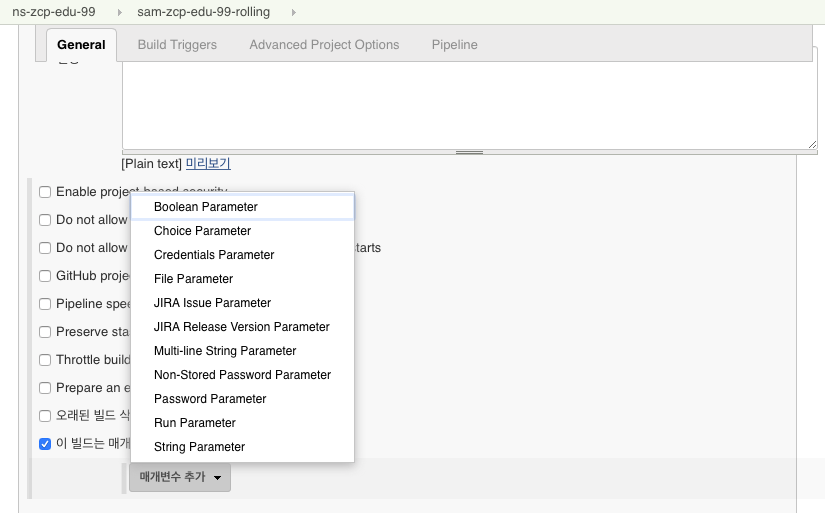
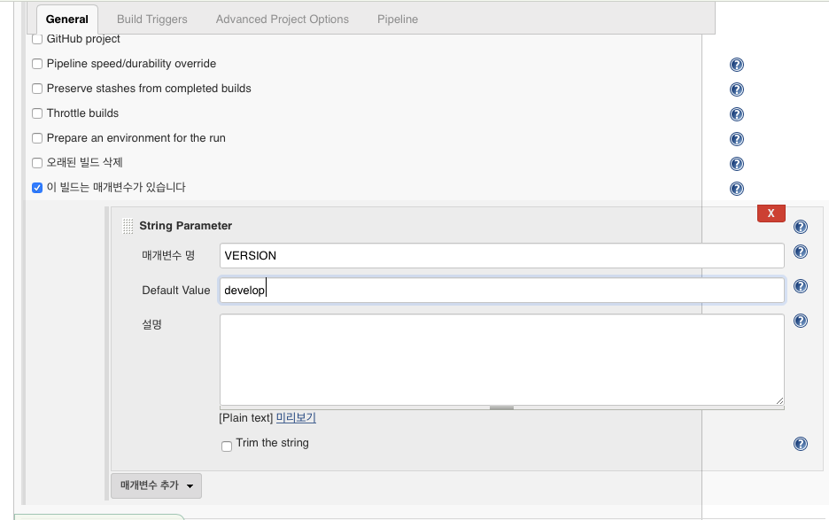

# Step 03. Rolling Update
> Production 운영환경에 배포하는 방법으로 설명. Master branch사용

## Rolling update

### Deployment 수정

* spec.strategy.type: Rollingupdate  # 배포방식 설정
* spec.strategy.rollingUpdate.maxSurge: 1  # Rolling 단위 설정
* spec.strategy.rollingUpdate.maxUnavailable: 1 # down pod 최소 단위

```yaml
apiVersion: apps/v1
kind: Deployment
metadata:
  name: spring-boot-cicd-demo
  labels:
    app: spring-boot-cicd-demo
spec:
  replicas: 5
  selector:
    matchLabels:
      app: spring-boot-cicd-demo
  strategy:
    type: RollingUpdate
    rollingUpdate:
      maxSurge: 1
      maxUnavailable: 1
....
```

### Pipeline 작성
sam-zcp-edu-99-rolling 이름으로 Pipeline작성

[Jenkins 참조](jenkins.md#pipeline-복사)

1. Pipeline 설정에서 Parameter 설정 : VERSION 처리를 위해 Pipeline에 변수 추가
2. General 영역에서 *이 빌드는 매개변수가 있습니다.* 체크
3. 매개변수 추가 Click > String Parameter
   1. 매개변수명 : VERSION
   2. Default Value: develop
   
   
4. Pipeline 영역
   1. Script Path : Production용 파일로 변경. jenkins-pipeline/rolling-pipeline
5. Git project의 jenkins-pipeline/rolling-pipeline 파일 편집
6. *VERSION* 변수선언 주석 처리

```groovy
// def VERSION = ‘develop’
```
7. Job 설정의 Deploy 변경

```groovy
@Library('retort-lib') _
def label = "jenkins-${UUID.randomUUID().toString()}"
 
def ZCP_USERID = 'edu99'
def DOCKER_IMAGE = 'edu99/spring-boot-cicd-demo'
def K8S_NAMESPACE = 'ns-zcp-edu-99'
//def VERSION = 'develop'
 
podTemplate(label:label,
    serviceAccount: "zcp-system-sa-${ZCP_USERID}",
    containers: [
        containerTemplate(name: 'maven', image: 'maven:3.5.2-jdk-8-alpine', ttyEnabled: true, command: 'cat'),
        containerTemplate(name: 'docker', image: 'docker', ttyEnabled: true, command: 'cat'),
        containerTemplate(name: 'kubectl', image: 'lachlanevenson/k8s-kubectl', ttyEnabled: true, command: 'cat')
    ],
    volumes: [
        hostPathVolume(hostPath: '/var/run/docker.sock', mountPath: '/var/run/docker.sock'),
        persistentVolumeClaim(mountPath: '/root/.m2', claimName: 'zcp-jenkins-mvn-repo-custom2')
    ]) {
 
    node(label) {
        stage('SOURCE CHECKOUT') {
            def repo = checkout scm
        }
 
        stage('BUILD MAVEN') {
            container('maven') {
                mavenBuild goal: 'clean package', systemProperties:['maven.repo.local':"/root/.m2/${ZCP_USERID}"]
            }
        }
 
        stage('BUILD DOCKER IMAGE') {
            container('docker') {
                dockerCmd.build tag: "${HARBOR_REGISTRY}/${DOCKER_IMAGE}:${VERSION}"
                dockerCmd.push registry: HARBOR_REGISTRY, imageName: DOCKER_IMAGE, imageVersion: VERSION, credentialsId: "HARBOR_CREDENTIALS"
            }
        }
 
        stage('DEPLOY') {
            container('kubectl') {
                
                yaml.update file: 'k8s/deployment.yaml', update: ['.spec.template.spec.containers[0].image': "${HARBOR_REGISTRY}/${DOCKER_IMAGE}:${VERSION}"]
                kubeCmd.apply file: 'k8s/deployment.yaml', namespace: K8S_NAMESPACE, wait: 300
            }
        }
    }
}

```
### 소스변경
1. Open file(./src/main/resource/static/css/style.css)
2. 47 line의 색상 값 변경 (background-color: #157ed2; --> background-color: red)
3. Stage & Commit
4. Push to origin/master(Git Server)

### Rolling update 실행

1. Click : *Build with Parameters*
2. *VERSION*  입력 : rolling-1
   
   
3. pod 상태 확인 : kubecrl get deploy -n edu01

   

## Rolling rollback

### Pipeline 설정 
sam-zcp-edu-99-rollback 이름으로 Pipeline작성

[Jenkins 참조](jenkins.md#pipeline-복사)

1. Script Path 수정 : jenkins-pipeline/rollback-pipeline

    

2. 환경구성 & Volume은  Deploy 용만 작성
3. Deploy rollback jenkins scrupt 작성 

```groovy
@Library('retort-lib') _
def label = "jenkins-${UUID.randomUUID().toString()}"
 
def ZCP_USERID = 'edu99'
def K8S_NAMESPACE = 'ns-zcp-edu-99'
def TYPE = 'deployment'
def DEPLOY_NAME = 'spring-boot-cicd-demo'

podTemplate(label:label,
    serviceAccount: "zcp-system-sa-${ZCP_USERID}",
    containers: [
        containerTemplate(name: 'kubectl', image: 'lachlanevenson/k8s-kubectl', ttyEnabled: true, command: 'cat')
    ]) {

    node(label) {
        stage('ROLLBACK') {
            container('kubectl') {
                kubeCmd.rolloutUndo type: TYPE, name: DEPLOY_NAME, namespace: K8S_NAMESPACE, wait: 300
            }
        }
    }
}

```

### Rollback 실행


> Application의 변경된 내용 확인.

---
[[toc]]